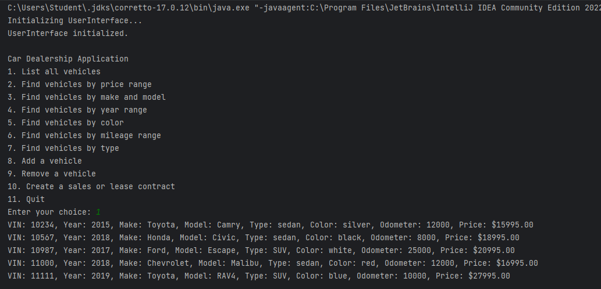
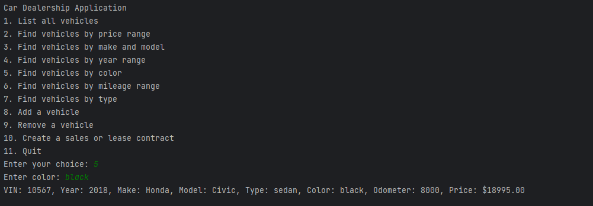
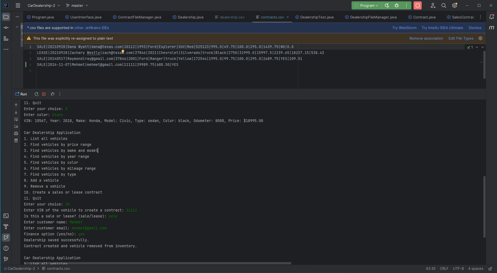

# Car Dealership Console Application

## Description of the Project

This Java console application is designed for use by a dealership salesperson, sales manager, or leasing agent to manage the dealership's inventory and customer transactions. The application allows users to list, search, add, remove vehicles, and handle sales or lease contracts with customers. Changes are automatically saved to files, providing a simple yet reliable solution for inventory and contract management. Built with Object-Oriented principles, the project is structured for ease of maintenance and future expansion.

## User Stories

- **Salesperson:** I want to find vehicles by specific criteria (price, make, model, year, etc.) to quickly meet customer needs.
- **Manager:** I want to add or remove vehicles from inventory to ensure records are always up to date.
- **User:** I want a clear and simple menu interface to easily navigate the application's features.
- **Salesperson:** I want to view all available vehicles at once to provide a quick overview to customers.
- **User:** I want to search for vehicles by mileage range to identify options with lower mileage.
- **Manager:** I want inventory changes (adding or removing vehicles) to be automatically saved to maintain data integrity.
- **User:** I want to find vehicles by color to better meet customer preferences.
- **Manager:** I want the inventory data saved in a consistent format so that it’s easy to load and manage.
- **User:** I want to see detailed information about each vehicle (VIN, make, model, year, color, mileage, price) to make informed decisions.
- **Salesperson:** I want to quickly search by vehicle type (e.g., car, truck, SUV) to match customer needs based on their preferences.
- **Manager:** I want the application to be responsive to erroneous inputs (e.g., letters in numeric fields) to preserve data integrity.
- **User:** I want an option to exit the application safely, ensuring that my current session is saved and closed properly.
- **Salesperson:** I want to create contracts for sales and leases with customers and save them for future reference.

## Setup

### Prerequisites

- **IntelliJ IDEA**: Ensure you have IntelliJ IDEA installed, which you can download from [here](https://www.jetbrains.com/idea/download/).
- **Java SDK**: Make sure Java SDK (version 8 or later) is installed and configured in IntelliJ.

### Running the Application in IntelliJ

1. Open IntelliJ IDEA.
2. Select "Open" and navigate to the directory where you cloned or downloaded the project.
3. Wait for IntelliJ to index the files and set up the project.
4. Find the `Program` class containing the `public static void main(String[] args)` method.
5. Right-click on `Program.java` and select 'Run 'Program.main()' to start the application.

## Features

The application offers the following functionalities:

1. **List All Vehicles**: Displays all vehicles in the dealership inventory.
2. **Search by Price Range**: Find vehicles within a specified price range.
3. **Search by Make and Model**: Locate vehicles by specific make and model.
4. **Search by Year Range**: Filter vehicles by year range.
5. **Search by Color**: Find vehicles based on color.
6. **Search by Mileage Range**: Filter vehicles by mileage range.
7. **Search by Vehicle Type**: Locate vehicles by type (e.g., sedan, truck, SUV).
8. **Add a Vehicle**: Add a new vehicle to the inventory.
9. **Remove a Vehicle**: Remove an existing vehicle from the inventory.
10. **Sell or Lease a Vehicle**: Create a contract for a vehicle sale or lease with specific customer information.
11. **Quit**: Exit the application.

## Contract Management

- **Sales Contract**: Allows users to record vehicle sales, including tax, processing fees, and optional financing with interest rates.
- **Lease Contract**: Records vehicle leases with details such as lease terms, lease fees, and interest rates.
- **Persistence**: Contracts are saved to a file (`contracts.csv`) to ensure they are available for later reference.

## Technologies Used

- **Java**: (Amazon Coretto version 17.0.12) Object-Oriented Programming Language (Java SDK 8+)
- **IntelliJ IDEA**: Integrated Development Environment (IDE)
- **File Handling**: Persist data (e.g., inventory, contracts) using CSV files

## Demo

Include screenshots or GIFs demonstrating the application in action (e.g., listing all vehicles, searching by criteria, adding/removing vehicles, creating a sales/lease contract).

- Application Screenshot: 
- Search Vehicle: 
- Create Contract: 

## Future Work

Potential enhancements:

- **Multiple Dealership Management**: Allow switching between multiple dealership inventories.
- **Database Integration**: Transition from file-based persistence to a database for scalability.
- **Enhanced Search**: Add advanced filtering options such as search by multiple criteria at once.
- **Admin Interface**: Add a secure admin interface to view contracts, add-ons, and user activity logs.
- **Add-ons for Vehicles**: Include add-on features (e.g., Nitrogen Tires, Window Tinting) to increase sales options.

## Interesting Code Example

One interesting piece of code in this project is the `getMonthlyPayment()` method in the `SalesContract` class, which demonstrates calculating monthly payments based on interest rate, number of payments, and total price. This method provides a real-life financial application to the dealership.

```java
@Override
public double getMonthlyPayment() {
    if (financeOption) {
        int numberOfPayments = (getVehicle().getPrice() >= 10000) ? 48 : 24;
        double interestRate = (getVehicle().getPrice() >= 10000) ? 4.25 / 1200 : 5.25 / 1200;
        double monthlyPayment = getTotalPrice() * (interestRate * Math.pow(1 + interestRate, numberOfPayments)) / (Math.pow(1 + interestRate, numberOfPayments) - 1);
        monthlyPayment = Math.round(monthlyPayment * 100) / 100.0;
        return monthlyPayment;
    } else {
        return 0.0;
    }
}
``` 
## Resources

- [Java Programming Basics](https://www.java.com/en/)
- [Effective Java by Joshua Bloch](https://www.oreilly.com/library/view/effective-java/9780134686097/)
- [Maven: The Complete Reference](https://maven.apache.org/guides/index.html)

## Team Members

- **Mehmet Uzun** - Developer

## Thanks

- Thank you to **Raymond Maroun** for continuous support and guidance.
- A special thanks to all teammates for their dedication and teamwork throughout the project.
